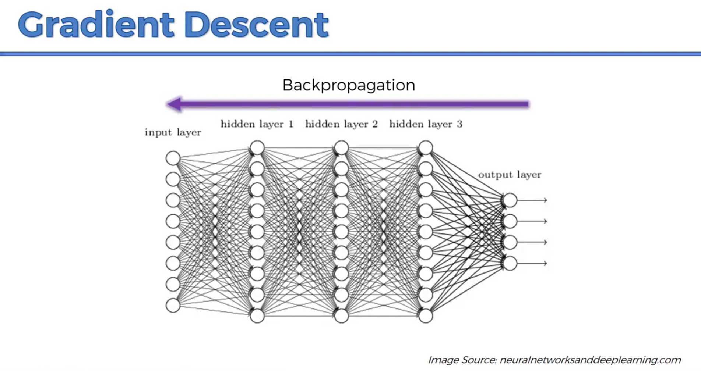
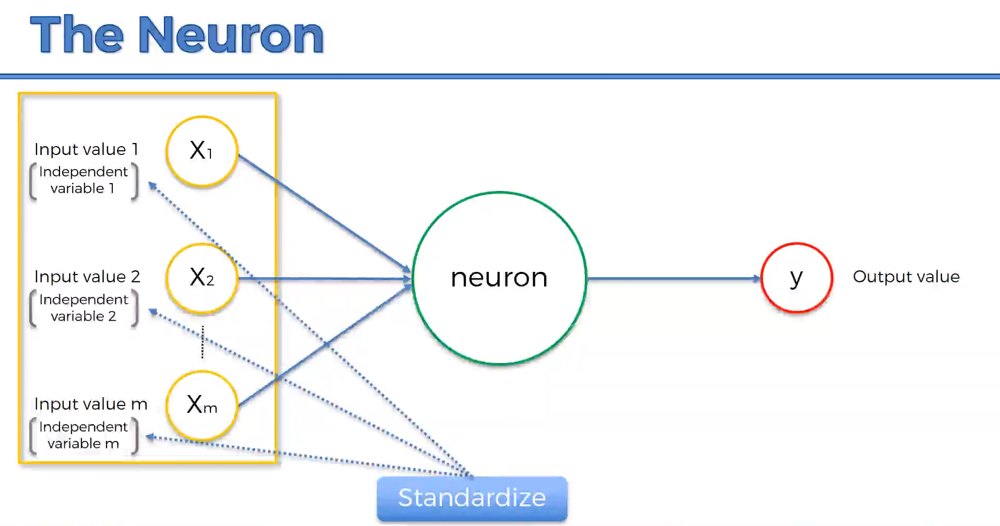
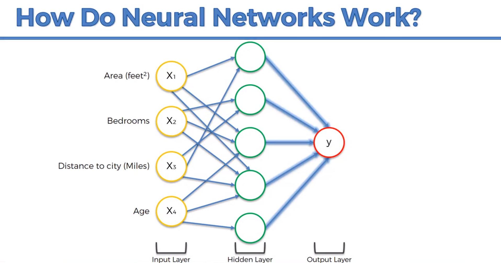
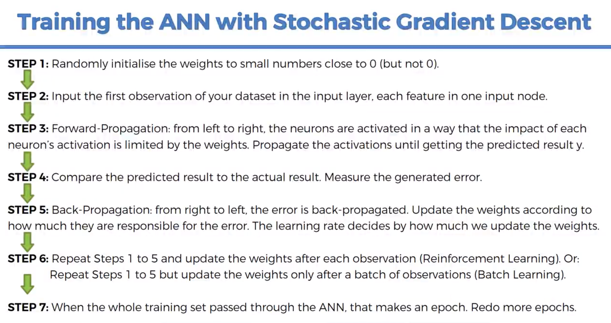

Created an Artificial Neural Network that solves the real-world problem of why customers are leaving a bank. The data set contains
10k customers with information such as their Name, Age, Gender, Credit Score, Tenure, Location, etc.

The problem we are dealing with is a classification problem, which means we have independent variables, and we need to predict
a binary outcome for the dependent variable: 1 if customer leaves, 0 if customer stays. We first need to prepare the data
correctly. This includes deciding which independent variables we want in the matrix of features. The decision is made based
on the impact that an independent variable will have on the dependent variable. Things such as credit score, geography, or age.

Next, we split the dataset into a training and test set. Before that though, is a small step which is to encode the categorical
data. If it is not encoded, I wouldn't be able to split it. The only categorical data we have is geography and gender. WHen
splitting the data, the tes size is set to .2, which means the ANN will be trained on 8,000 observations and will be test on
2,000 observations.

Third, feature scaling is applied. Feature scaling essentially eases the burden of making high intensive computations which
include parallel computations.

Fourth, the ANN will be defined as a sequence of layer. To do this we create an object called classifier and initiliaze it using
Sequential. Next, we add the input layer and the first hidden layer. Then we add more hidden layers and finally the output layer.

